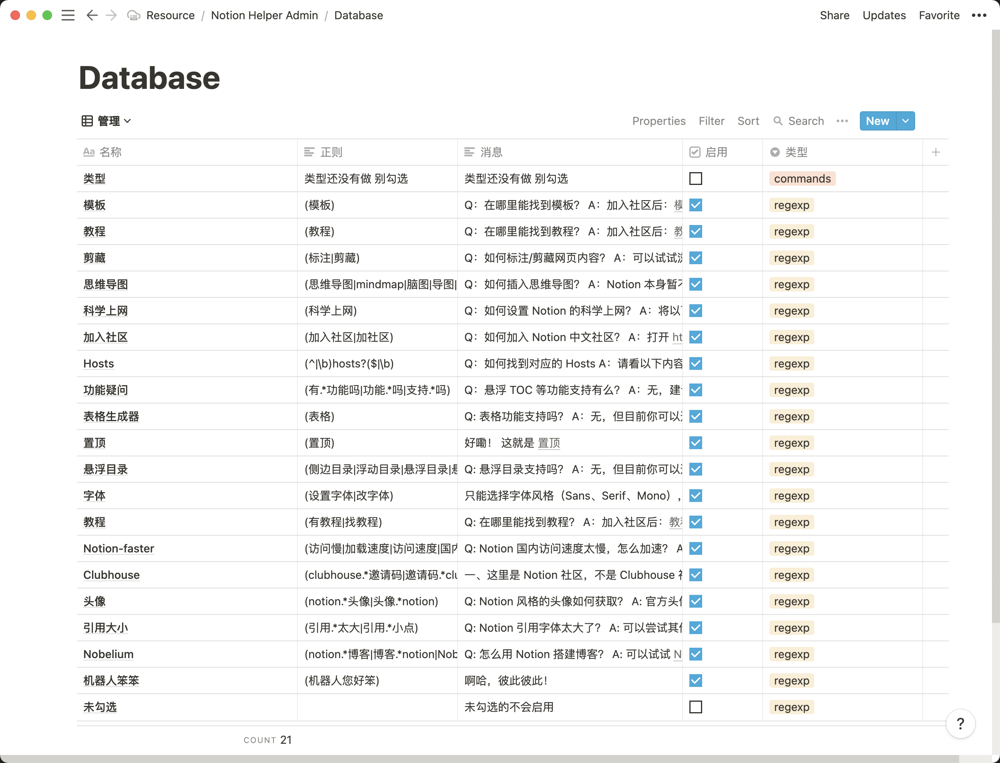
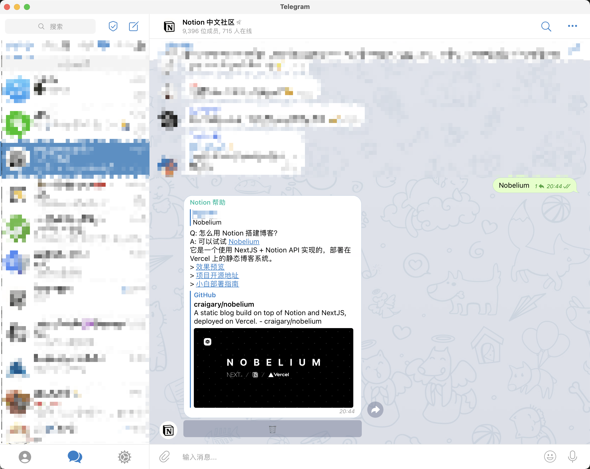

# Notion-Help-Bot  [English | [中文](./README_ZH.MD)]

A Telegram bot designed for [Notion CN Community](https://t.me/Notionso).  
Powered by [Notion Official API](https://developers.notion.com/).

# Features
- Notion as a **dataase** 
- Keyword triggers
- Delete button

# Programme Structure
  

# Database Structure
  

# Screenshot
    