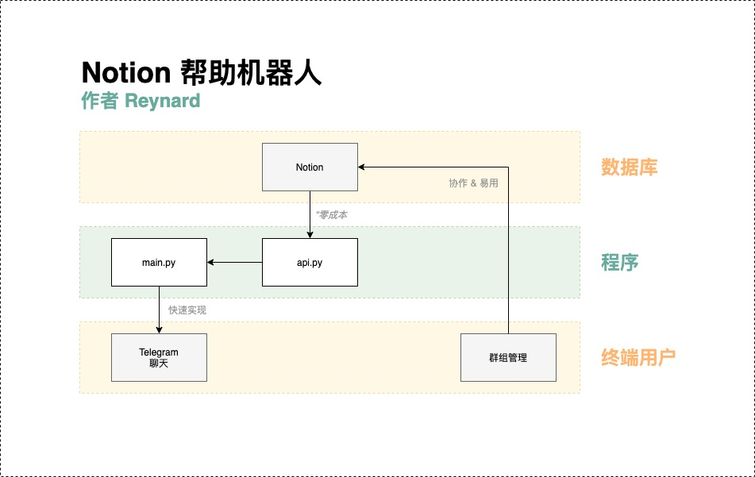

# Notion 帮助机器人 [[English](./README.MD) | 中文]

为 [Notion 中文社区](https://t.me/Notionso) 设计的 Telegram 帮助机器人。  
使用 [Notion 官方 API](https://developers.notion.com/)。

# 特性
- Notion 作为一个**数据库** 
- 关键词触发
- 误触删除按钮

# 程序结构
  

# 数据库结构
  

# 实现效果
  